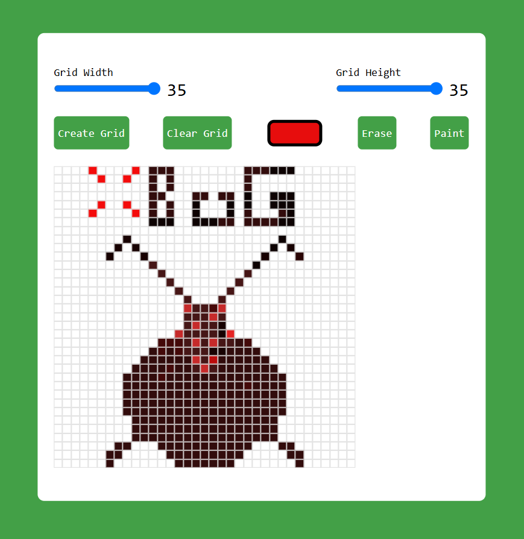

# 🎨 Pixel Art Generator  

Pixel Art Generator is a fun and creative tool that lets you design pixel-based artwork easily. Whether you're an artist, a game designer, or just experimenting with pixel art, this tool helps bring your creativity to life!  

## 🚀 Features  
✅ **Customizable Grid Size** – Choose the canvas size that fits your needs  
✅ **Color Palette Selection** – Pick from a variety of colors to create stunning pixel art  
✅ **Erase & Reset Options** – Easily edit or start over  
✅ **Download Artwork** – Save your pixel creations as an image  
✅ **Responsive & User-Friendly UI** – Works on both desktop and mobile  

## 🛠 Technologies Used  
- **Frontend:** HTML, CSS, JavaScript  
- **Canvas API** for drawing pixels  
- **(Optional) Backend:** Node.js, Express.js for saving artwork online
- 
📷 Screenshots
🎨 Drawing Interface



### 1️⃣ Clone the Repository  
```sh
git clone https://github.com/your-username/pixel-art-generator.git

